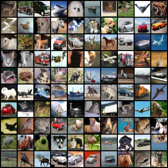
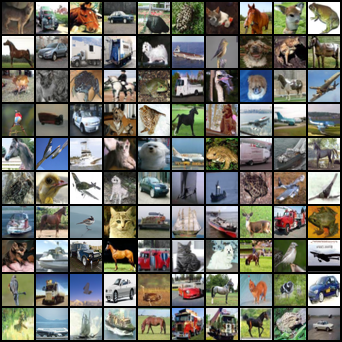

# Reproducing the results from Discriminator Guidance in Score-based Diffusion Models

## Authors

- Mehdi Abdellaoui
- Carl Persson 
- Eduardo Santos Escriche

## Overview

In this repository we provide the code for our attempt at reproducing the results from [Discriminator Guidance in Score-based Diffusion Models](https://arxiv.org/abs/2211.17091), where the authors introduce a new method aiming to improve the sample generation process for pre-trained diffusion models, called Discriminator Guidance

In our [project report](https://github.com/MehdiAbdellaoui/DiffusionGuidance/blob/main/report/DD2412_Project_Report.pdf), we are able to produce very similar FID scores to those presented in the paper for the CIFAR-10 dataset and the EDM-G++ sampling method. In addition, we explore the statistical significance of those results, as well as the sensitivity of the $S_{churn}$ hyperparameter. Lastly, we go beyond the scope of the paper by implementing and analyzing the performance of including the Low-Rank adaptation (LoRA) method for finetuning the discriminator, which we show can improve the FID score for unconditionally generated samples from $1.83$ to $1.79$.

## Code execution

### 1) Create conda environment

```
conda create --name <env> --file requirements.txt
```

### 2) Get the necessary files

All the necessary files to run the following commands are available in our [public Google Drive](https://drive.google.com/drive/folders/1YwuWQTVLBuTKrx97R_CKimYEyXJm7x9j?usp=sharing)

### 3) Generate fake samples

```
python generate.py --network https://nvlabs-fi-cdn.nvidia.com/edm/pretrained/edm-cifar10-32x32-uncond-vp.pkl --num_samples=10000 --batch 100 --outdir training_data --discriminator_checkpoint models/uncond_disc/discrim_uncond_epoch59.pt --conditional 0 --adaptive_weight 0 --w_dg_1 0.
```

With LoRA: 

```
python generate.py --network https://nvlabs-fi-cdn.nvidia.com/edm/pretrained/edm-cifar10-32x32-cond-vp.pkl --num_samples=50000 --batch 75 --outdir training_data --discriminator_checkpoint models/lora_cond_disc/discrim_cond_final128.pt --conditional 1 --adaptive_weight 1 --w_dg_1 1. --lora_checkpoint models/lora_uncond_disc/cond_adm_final128.pt --lora_rank 128
```

### 4) Prepare a pre-trained classifier

- Download [models/cond_disc/discrim_cond_epoch.pt](https://drive.google.com/drive/folders/1YwuWQTVLBuTKrx97R_CKimYEyXJm7x9j?usp=sharing)
- Place **32x32_classifier.pt** at the directory models/cond_disc/discrim_cond_epoch.pt.

### 5) Train a discriminator

```
python train.py --sample_dir training_data/conditional_edm_samples/edm_cond_samples.npz --save_dir models/ --cond 1 --lora_rank 128 --batch_size 64
```

```
python train.py --sample_dir training_data/unconditional_edm_samples/edm_uncond_samples.npz --save_dir models/ --cond 0 --lora_rank 128 --batch_size 64
```
### 6) Generate discriminator-guided samples
 
```
python generate.py --network https://nvlabs-fi-cdn.nvidia.com/edm/pretrained/edm-cifar10-32x32-cond-vp.pkl --num_samples=50000 --batch 75 --outdir training_data --discriminator_checkpoint models/lora_cond_disc/discrim_cond_final128.pt --conditional 1 --adaptive_weight 1 --w_dg_1 1. --lora_checkpoint models/lora_uncond_disc/cond_adm_final128.pt --lora_rank 128
```
```
python generate.py --network https://nvlabs-fi-cdn.nvidia.com/edm/pretrained/edm-cifar10-32x32-uncond-vp.pkl --num_samples=50000 --batch 75 --outdir training_data --discriminator_checkpoint models/lora_uncond_disc/discrim_uncond_final16.pt --conditional 0 --adaptive_weight 0 --w_dg_1 2. --lora_checkpoint models/lora_uncond_disc/lora_adm_final16.pt --lora_rank 16
```

With LoRA: 

```
python generate.py --network https://nvlabs-fi-cdn.nvidia.com/edm/pretrained/edm-cifar10-32x32-uncond-vp.pkl --num_samples=10000 --batch 100 --outdir training_data --discriminator_checkpoint models/uncond_disc/discrim_uncond_epoch59.pt --conditional 0 --adaptive_weight 0 --w_dg_1 2.
```
```
python generate.py --network https://nvlabs-fi-cdn.nvidia.com/edm/pretrained/edm-cifar10-32x32-uncond-vp.pkl --num_samples=50000 --batch 100 --outdir training_data --discriminator_checkpoint models/cond_disc/discrim_cond_epoch249.pt --conditional 1 --adaptive_weight 1 --w_dg_1 1.
```

### 7) Evaluate FID

To generate the FID plot for the unconditional model checkpoints, use: 

```
python fid.py --images=./samples --ref=./stats/cifar10-32x32.npz --plot=True --num_samples=10000
```


## Experimental Results

### EDM-G++

| Model | Unconditional | Conditional |
|--------------------------------------------------|--------------------------------------------|------------------------------------------|
|                                                  | NLL $\downarrow$                  | FID-50k $\downarrow$            | FID-50k $\downarrow$ |
| EDM (random seed)                                | 2.60                                       | 2.03                                     | 1.82                          |
| EDM (manual seed)                                | 2.60                                       | 1.97                                     | 1.79                          |
| EDM-G++ (random seed)                            | 2.55                                       | 1.77                                     | 1.64                          |
| EDM (ours)                                       | 3.53                                       | 1.96                                     | 1.85                          |
| EDM-G++ (ours)                                   | 3.29                                       | 1.83                                     | 1.66                          |

### EDM-G++ with LoRA

| Model  |                    | Unconditional  | Conditional |
|--------------------------------------------------|--------------------|--------------------------------------------|------------------------------------------|
|                                                  | LoRA rank | FID-50k $\downarrow$              | FID-50k $\downarrow$            |
| EDM                                              | N/A                | 1.96                                       | 1.85                                     |
| EDM-G++                                          | N/A                | 1.83                                       | 1.66                                     |
| LoRA EDM-G++                                     | 16                 | 1.83                                       | 1.65                                     |
| LoRA EDM-G++                                     | 128                | 1.79                                       | 1.68                                     |


### Samples from unconditional Cifar-10 EDM 



### Samples from unconditional Cifar-10 EDM-G++ with LoRA



## Additional references

Similarly to the original repository, we also take inspiration from the methods proposed in the following papers:

- *Karras, T., Aittala, M., Aila, T., & Laine, S. (2022). Elucidating the design space of diffusion-based generative models. arXiv preprint arXiv:2206.00364.*
- *Dhariwal, P., & Nichol, A. (2021). Diffusion models beat gans on image synthesis. Advances in Neural Information Processing Systems, 34, 8780-8794.*
- *Song, Y., Sohl-Dickstein, J., Kingma, D. P., Kumar, A., Ermon, S., & Poole, B. (2020). Score-based generative modeling through stochastic differential equations. arXiv preprint arXiv:2011.13456.*


